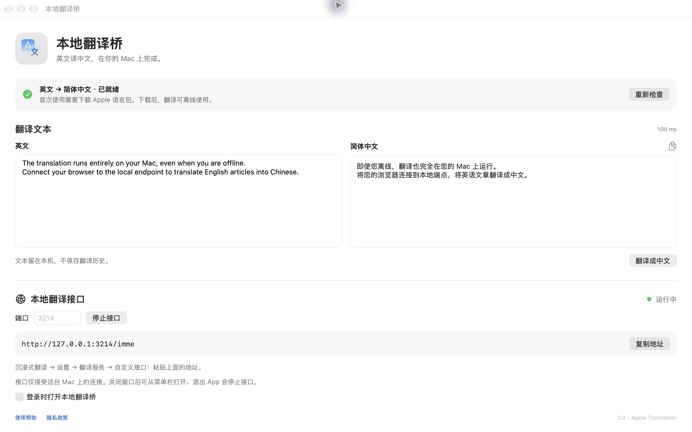

# Apple Translation Bridge

Turn Apple's on-device Translation framework into a local HTTP API for Immersive Translate.

在 Apple silicon Mac 上运行的本地翻译服务，直接调用 Apple 的公开 Translation framework。默认使用 `lowLatency` 模式和英文→中文语言包，下载后可离线翻译。提供沉浸式翻译自定义接口、语言包安装器、浏览器测试页面和登录自启动脚本。

## 原生 macOS App

`MacApp/` 包含独立的沙盒应用「本地翻译桥 / Local Translate Bridge」。它提供文本翻译窗口、系统语言包下载入口、菜单栏和本机 HTTP 接口，使用同一套 Swift 翻译核心。App 运行时不依赖 Python 或 shell 脚本。



使用 Xcode 和 [XcodeGen](https://github.com/yonaskolb/XcodeGen) 构建：

```bash
xcodegen generate --spec MacApp/project.yml
xcodebuild -project MacApp/LocalTranslateBridge.xcodeproj \
  -scheme LocalTranslateBridge -configuration Debug \
  -destination 'platform=macOS' -derivedDataPath .build/mac-app \
  CODE_SIGNING_ALLOWED=NO build
codesign --force --deep --sign - --entitlements MacApp/App.entitlements \
  .build/mac-app/Build/Products/Debug/LocalTranslateBridge.app
open .build/mac-app/Build/Products/Debug/LocalTranslateBridge.app
```

在 App 中下载英文和简体中文语言包后，可以直接翻译文本，或点击「启动接口」接入沉浸式翻译。默认监听 `127.0.0.1:3210`，端口被占用时可在窗口中修改。接口只能从本机连接。关闭窗口后 App 会留在菜单栏，退出 App 会停止接口；登录启动默认关闭，需自行开启。

首版界面为简体中文，翻译窗口和下载入口提供英文→简体中文。`metadata/` 保存中英文商店资料及审核说明，`docs/` 保存[使用帮助](https://malu.moe/apple-translation-bridge/)和[隐私政策](https://malu.moe/apple-translation-bridge/privacy.html)。商店审核和上架状态以 App Store Connect 为准。

## 要求

- Apple silicon Mac（M1 或更新）。
- macOS **26.4 或更新**。
- Xcode 或 Command Line Tools，包含 macOS **26.4+ SDK** 和 Swift 6 工具链。
- 命令行服务需要 Python **3.9+**，只使用标准库。原生 App 不需要 Python。
- 首次下载语言包时，需要在 Mac 桌面确认 Apple 的系统下载提示。

语言包由 macOS 下载和管理，不包含在仓库中。

## 构建并运行

```bash
git clone https://github.com/malusama/apple-translation-bridge.git
cd apple-translation-bridge
./scripts/build.sh

# 在运行服务的 Mac 上下载英文→中文语言包
open .build/AppleTranslationSetup.app

# 前台运行服务
python3 .build/server.py --port 3210
```

首次下载需要保持 Mac 解锁，直到安装器显示语言包已就绪。安装器会完成一次真实翻译并检查 `isReady`，之后才显示成功。后续后台翻译不需要保留安装器窗口。

打开 <http://127.0.0.1:3210/> 可以直接测试翻译。状态接口是 <http://127.0.0.1:3210/health>。

## 登录自启动

```bash
./scripts/install.sh
open ~/.local/share/apple-translation-bridge/AppleTranslationSetup.app
```

安装到当前用户的目录，无需 `sudo`：

- 程序：`~/.local/share/apple-translation-bridge/`
- 日志：`~/.local/state/apple-translation-bridge/`
- LaunchAgent：`~/Library/LaunchAgents/com.local.apple-translation-bridge.plist`

可以通过环境变量调整安装位置和端口：

```bash
APPLE_TRANSLATION_PORT=3211 ./scripts/install.sh
```

可选变量：`APPLE_TRANSLATION_PORT`、`APPLE_TRANSLATION_DATA_DIR`、`APPLE_TRANSLATION_STATE_DIR`、`APPLE_TRANSLATION_BUILD_DIR`。

重新运行安装脚本会更新并重启同一个服务。查看状态或重启：

```bash
launchctl print gui/$(id -u)/com.local.apple-translation-bridge
launchctl kickstart -k gui/$(id -u)/com.local.apple-translation-bridge
```

卸载自启动服务：

```bash
./scripts/uninstall.sh
```

卸载脚本保留程序、日志和系统语言包。

## 沉浸式翻译

在沉浸式翻译设置中选择「自定义接口」，填写：

```text
http://127.0.0.1:3210/imme
```

看不到「自定义接口」时，先在开发者设置中启用 Beta 特性。不需要 API Key。建议从每次 **8 段**、每秒 **2 个请求**开始，再根据自己的 Mac 调整。

## 另一台 Mac 通过 SSH 使用

在服务端 Mac 上完成安装，在浏览器所在的 Mac 上运行：

```bash
# my-translation-mac 是你自己的 ~/.ssh/config 主机别名，也可以是 user@host
ssh my-translation-mac true
./scripts/tunnel.sh my-translation-mac
```

此脚本要求 SSH 密钥登录已配置完成，并以 `BatchMode` 运行。隧道与服务都只监听 `127.0.0.1`。脚本使用独立 SSH 连接，关闭连接复用，避免 launchd 被后台 ControlMaster 提前退出影响。

指定两端端口，或卸载隧道：

```bash
./scripts/tunnel.sh my-translation-mac 3210 3211
./scripts/tunnel.sh --remove
```

## API

`POST /imme`（`POST /translate` 也是同一接口）：

```bash
curl --fail-with-body http://127.0.0.1:3210/imme \
  -H 'Content-Type: application/json' --data-binary @- <<'JSON'
{
  "source_lang": "auto",
  "target_lang": "zh-CN",
  "text_list": [
    "Hello, world.",
    "Open {0} to read the documentation and select {1} to continue."
  ]
}
JSON
```

响应：

```json
{
  "engine": "Apple Translation",
  "elapsed_ms": 119,
  "translations": [
    {"detected_source_lang": "en", "text": "你好，世界。"},
    {"detected_source_lang": "en", "text": "打开{0}阅读文档，然后选择{1}继续。"}
  ]
}
```

`elapsed_ms` 是引擎处理耗时，示例中的数值不代表所有机器的性能。

- `source_lang` 可以是语言代码或 `auto`；自动识别后按源语言分别批量翻译，保持段落顺序。
- `target_lang` 必须指定，支持 `zh-CN`/`zh-Hans`、`zh-TW`/`zh-Hant` 等代码。
- 每次接受 **1–128 段**，合计最多 **100000 字符**、**1 MB** 请求体。服务不截断输入。
- 支持 HTTP/1.1 keep-alive、CORS 预检和最多 8 个排队请求。一个常驻 Swift worker 顺序处理请求，复用翻译会话。
- `{0}`、HTML 标签和 URL 首先通过 `skipsTranslation` 标记保留；传统模型仍改动标记时，会翻译文本片段并原样拼回标记，再检查数量。此回退保留网页格式，片段间的语句衔接可能不如整段翻译。
- 没有语言的内容、空白及与目标语言相同的内容原样返回。

`GET /health` 和 `GET /languages` 返回引擎、语言支持、已安装状态和运行计数。默认 `ready:true` 表示英文→中文已安装；其他语言的状态请查看 `language_pairs`。`offline:true` 表示使用本地引擎，不代表语言包已经下载。

错误状态：

| HTTP 状态 | 含义 |
| --- | --- |
| 400 / 413 / 415 | 请求格式、大小或 Content-Type 错误 |
| 422 | 不支持的语言对或原生翻译错误 |
| 429 | 请求队列已满 |
| 503 | 语言包未安装，或翻译 worker 不可用 |

## 可选日文语言包

默认只下载英文→中文。需要日文时，关闭现有安装器后运行：

```bash
open .build/AppleTranslationSetup.app --args --include-japanese
# 已安装到用户目录时，也可使用该目录下的同名 app
```

其他语言需要在运行服务的 Mac 上下载对应系统语言包。Apple 支持的语言和语言对，以该系统版本的 `LanguageAvailability` 为准。

## 验证

先启动服务并安装语言包：

```bash
python3 verify.py
# 指定另一端口
python3 verify.py --port 3211
# 已安装日文时，同时检查日文
python3 verify.py --with-japanese
```

检查实际译文、混合内容与占位符、2374 字符段落末句、连接复用和 4 个并发请求（合计 32 段）。日文验证需要额外安装语言包；仓库的默认就绪条件仍是英文→中文。

安装配置可以预览，不加载服务：

```bash
./scripts/install.sh --dry-run /tmp/apple-translation-service.plist
./scripts/tunnel.sh --dry-run /tmp/apple-translation-tunnel.plist my-translation-mac
```

## 实现与参考

- `Sources/TranslationWorker.swift`：原生翻译、语言识别、批量分组和占位符处理。
- `Sources/LanguageSetup.swift`：请求系统语言包下载，并验证模型已就绪。
- `server.py`：HTTP 接口和 Swift worker 生命周期。
- `index.html`：本机测试页面。

[Apple TranslationSession](https://developer.apple.com/documentation/translation/translationsession)、[lowLatency 策略](https://developer.apple.com/documentation/translation/translationsession/strategy/lowlatency)、[沉浸式翻译自定义接口协议](https://immersivetranslate.com/zh-Hans/docs/services/custom/)。
